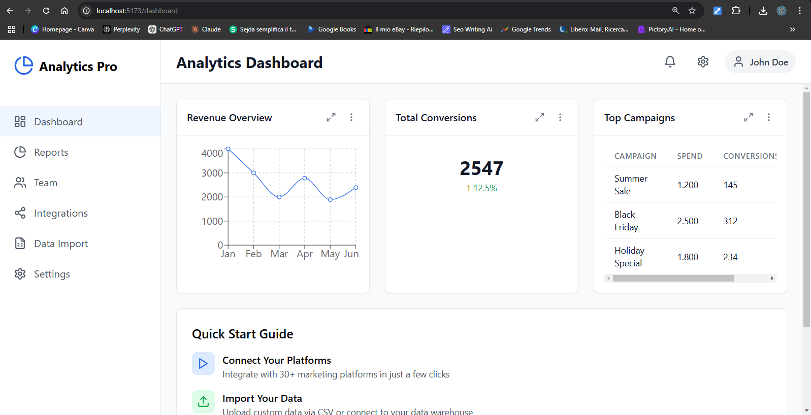

# Analytics Dashboard

**Analytics Dashboard** è un'applicazione moderna costruita con **React**, **Tailwind CSS**, e **Recharts**. Offre una dashboard interattiva per visualizzare dati, gestire integrazioni e personalizzare le impostazioni del tema, tutto in un'interfaccia utente intuitiva.


---

## Funzionalità Attuali

### 1. **Dashboard Interattiva**
   - Visualizzazione di widget dinamici (es. grafici, metriche, tabelle).
   - Esempio: Grafico delle entrate mensili, conteggio delle conversioni totali e analisi delle campagne principali.

### 2. **Data Import**
   - Importazione di file CSV tramite drag-and-drop o selezione manuale.
   - Tracciamento dello stato delle importazioni recenti (es. "Success" o "Failed").
   - Interfaccia intuitiva per caricare dati.

### 3. **Gestione delle Integrazioni**
   - Stato delle integrazioni con piattaforme come Google Analytics, Facebook Ads e TikTok Ads.
   - Possibilità di connettere o disconnettere piattaforme direttamente dalla dashboard.

### 4. **Personalizzazione del Tema**
   - Personalizzazione dei colori primari, secondari e di accento.
   - Branding con nome aziendale e URL del logo.
   - Preferenze utente:
     - Abilitazione delle notifiche email.
     - Aggiornamento automatico dei dati della dashboard.
     - Mostra/nascondi tooltip di aiuto.

### 5. **Sezioni Distinte**
   - **Reports**: Elenco dei report scaricabili in vari formati (PDF, CSV).
   - **Team**: (In sviluppo) Gestione e collaborazione con altri utenti.
   - **Settings**: Configurazione dell'aspetto e delle preferenze della dashboard.

---

## Struttura del Progetto

```
analytics-dash/
├── public/                # Static assets
├── src/                   # Main React application
│   ├── components/        # Componenti riutilizzabili (es. Sidebar, Header, Widget)
│   ├── pages/             # Pagine principali (es. Dashboard, DataImport, Settings)
│   ├── App.tsx            # Componente principale dell'app
│   └── index.tsx          # Punto di ingresso React
├── tailwind.config.js     # Configurazione Tailwind CSS
├── vite.config.ts         # Configurazione Vite.js
└── README.md              # Documentazione del progetto
```

---

## Come Avviare l'Applicazione

### Prerequisiti

Assicurati di avere installati:
- **Node.js** (v16 o successivo)
- **npm** (v8 o successivo)

---

### Istruzioni

1. **Clona il repository:**

   ```bash
   git clone https://github.com/your-username/analytics-dash.git
   cd analytics-dash
   ```

2. **Installa le dipendenze:**

   ```bash
   npm install
   ```

3. **Avvia il server di sviluppo:**

   ```bash
   npm run dev
   ```

4. **Apri l'app nel browser:**

   Visita [http://localhost:5173](http://localhost:5173) per visualizzare l'app.

---

## Tecnologie Utilizzate

- **Frontend:**
  - **React**: Framework JavaScript per creare interfacce utente dinamiche.
  - **Tailwind CSS**: Per uno stile rapido e personalizzabile.
  - **Recharts**: Per la visualizzazione di dati (grafici).

- **Dev Tools:**
  - **Vite**: Strumento di build veloce per lo sviluppo.
  - **ESLint**: Per mantenere una qualità del codice uniforme.
  - **TypeScript**: Aggiunge tipi statici a JavaScript per un codice più robusto.

---

## Funzionalità Future

1. **Backend con Express.js:**
   - Gestione API per caricamento file e autenticazione.
   - Collegamento con database per memorizzare dati e configurazioni.

2. **Autenticazione:**
   - Implementazione di un sistema di login sicuro utilizzando JWT.
   - Pagine protette per utenti autenticati.

3. **Gestione Team:**
   - Aggiunta di funzionalità per invitare e gestire membri del team.

4. **Miglioramenti alla Dashboard:**
   - Maggiore personalizzazione dei widget.
   - Aggiunta di tipi di grafici (es. pie chart, heatmap).

---

## Contribuire al Progetto

Contributi sono benvenuti! Segui questi passaggi per contribuire:

1. Fai un fork del repository.
2. Crea un branch per la tua funzionalità (`feature/nuova-funzionalità`).
3. Invia una pull request per la revisione.

---

## Licenza

Questo progetto è rilasciato sotto la licenza [MIT](LICENSE).

---

## Contatti

Per domande o suggerimenti, contatta:

- **Nome**: [your-email@example.com](mailto:your-email@example.com)
- **GitHub**: [https://github.com/your-username](https://github.com/your-username)
```

---

### **Cosa Aggiungere Dopo:**
- Una sezione per le API del backend una volta configurato.
- Dettagli sul sistema di autenticazione e protezione dei dati.
- Una demo live o un link per l'hosting (se pianificato).

